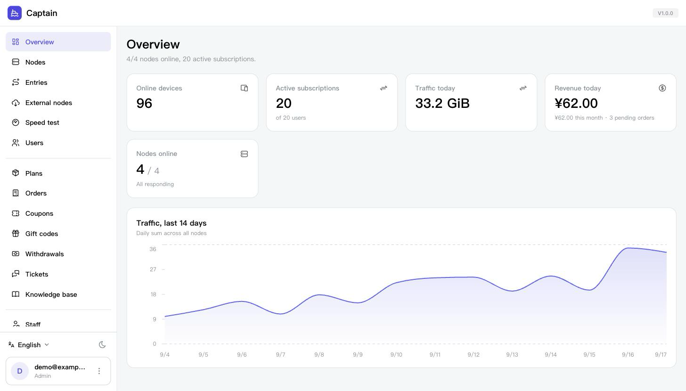
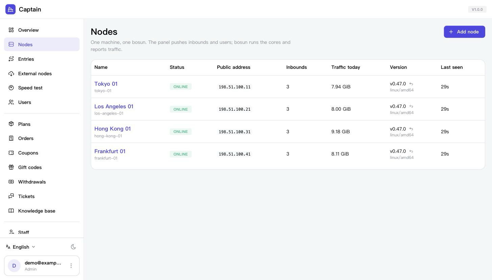
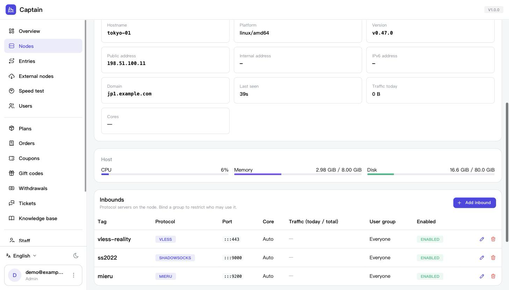
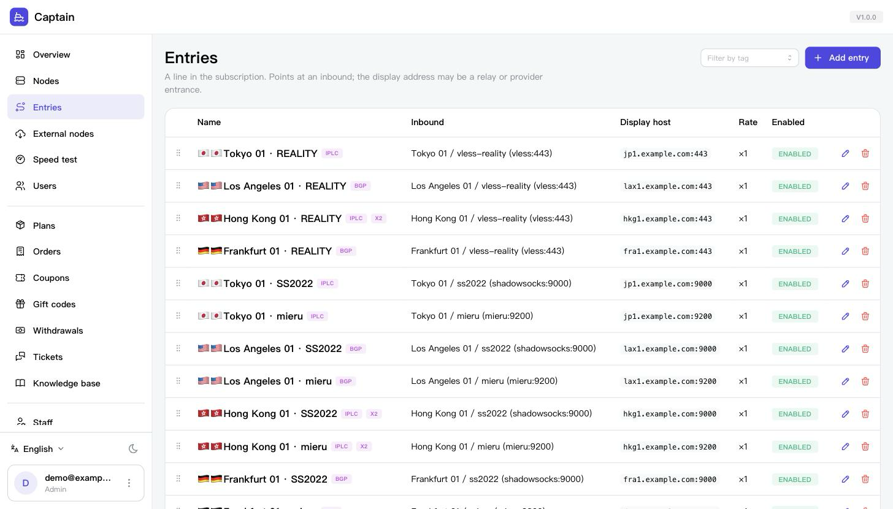
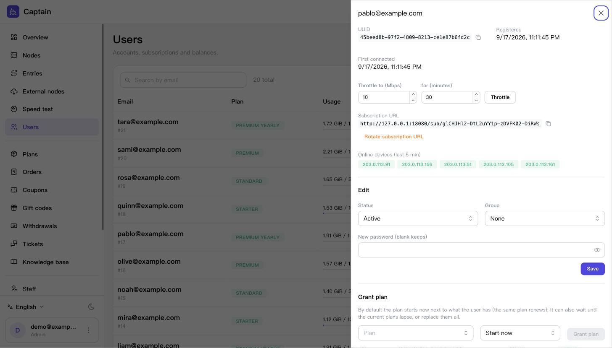
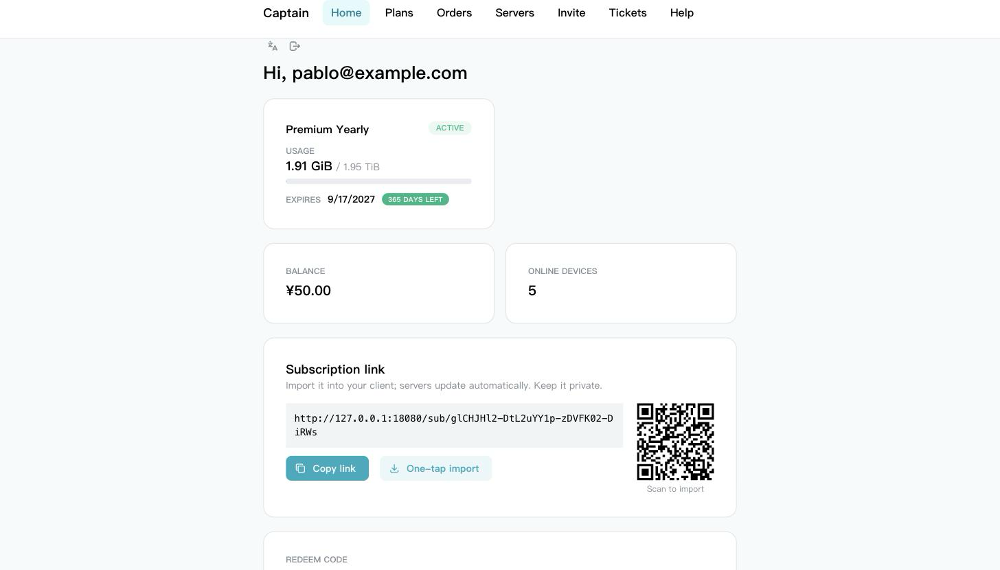

<div align="center">

# Captain

**A proxy panel that actually runs the fleet: users, plans, payments, subscriptions — and the nodes themselves.**

[](https://github.com/zeptop-dev/captain/releases)
[](https://github.com/zeptop-dev/captain/actions)
[](go.mod)
[](https://github.com/zeptop-dev/captain/releases)
[](https://hub.docker.com/r/zeptop/captain)
[](LICENSE)

[Install](#quick-start) · [Documentation](#documentation) · [Compatibility](docs/COMPATIBILITY.md) · [Changelog](CHANGELOG.md)

</div>

---

Captain is one Go binary with the admin console and the user portal embedded.
It sells access (plans, orders, eight payment gateways, invites, coupons,
tickets), renders subscriptions for every client people actually use, and
drives the nodes: you paste one command on a fresh server and the node
appears in the console, configured, with certificates.

The node side is [**bosun**](https://github.com/zeptop-dev/bosun), a root
agent that runs sing-box, Xray, mita (mieru), Hysteria, snell-server and
realm as child processes from the desired state Captain pushes. The two
speak a documented, add-only protocol, so a node never has to be upgraded
in lockstep with the panel.

> [!IMPORTANT]
> This is infrastructure for running your own service for yourself, your
> friends or your customers. You are responsible for what runs through it
> and for the law where your servers and your users are. Check both before
> you deploy.

## Features

**Protocols and cores** ([docs](docs/NODES.md#inbounds)) — VLESS (+ REALITY, with a decoy site and a target
scanner), VMess, Trojan, Shadowsocks (incl. 2022 ciphers), Hysteria2, TUIC,
AnyTLS, mieru, Snell, SOCKS, HTTP, NaiveProxy and WireGuard. Each inbound
picks its core; bosun installs and supervises the binaries, so there is no
fork of anything to maintain.

**Subscriptions that fit the client** ([docs](docs/SUBSCRIPTIONS.md)) — mihomo/Clash, Stash, sing-box,
Egern, Surge, Surfboard, Loon, Quantumult X, base64 share links (v2rayN,
Shadowrocket) and WireGuard `.conf`, each following that client's own
reference so a server it cannot express is simply left out. Per-format
templates, a visual proxy-group and rule designer with the ACL4SSR
catalogue, remark variables (`{{DAYS_LEFT}}`, `{{TRAFFIC_LEFT}}`, …), info
lines, short links and revocable temporary links.

**Billing** ([docs](docs/BILLING.md)) — plans with periods, quotas, device and speed limits; several
plans per user (stacked, queued, replace); orders paid by balance, EPay
易支付 (v1 MD5 and v2 RSA), Stripe, Alipay F2F, Coinbase Commerce,
CoinPayments, BTCPay Server or MGate. Every callback is signature-verified
before a field is read, settlement is idempotent, and a callback whose
amount differs from the order is refused. Coupons, gift codes, invite
commissions with withdrawals, surplus credit on upgrades.

**The fleet** ([docs](docs/NODES.md)) — one-line node install and pairing; inbounds with quick-setup
recipes; entries that decide what each group of users sees; port forwards
(built-in relay, nftables DNAT or realm) for relay chains with PROXY
protocol across hops; line ingresses for IPLC; egress that follows ingress;
per-node speed limits; node jobs (upgrade, rollback, REALITY scan,
speedtest) driven from the console.

**Hardening that is checked, not claimed** ([docs](docs/ADMIN.md#access-control-and-the-client-address)) — cores run under an
unprivileged account with only the capabilities they need; the node's own
address space (loopback, link-local, cloud metadata, RFC 1918) is refused
both in the cores' routing and by an nftables egress guard; the cores'
unauthenticated control APIs are reachable only by root. Origin checks on
cookie writes, argon2id passwords, TOTP for staff, API tokens with a
read-only scope and an expiry, an admin allow-list that also covers the MCP
endpoint, and a per-node doctor that reports what is actually wrong.

**Operations** ([docs](docs/MONITORING.md)) — probe page with per-node history and alerts, Prometheus
metrics, connection log and panel-wide audit rules with auto-ban, dynamic
speed limits computed across nodes, HWID device identification, response
rules on `/sub`, daily `VACUUM INTO` backups with WebDAV/S3 upload,
self-update for the panel and every node, Telegram bot and event webhooks,
and an MCP server so an agent can answer "which node is down" for you.

**Six languages** in both interfaces — 简体中文, 繁體中文, English, 日本語,
Русский, 한국어 — and the mail users receive has its own language picker in
Settings → Mail.

## Screenshots

<details open>
<summary>Console and portal</summary>

| | |
|---|---|
| **Overview** — fleet, traffic, revenue | **Nodes** — one machine, one bosun |
|  |  |
| **A node** — host metrics, cores, inbounds | **Entries** — what users see, with tags and regions |
|  |  |
| **A user** — plans, devices, throttle, subscription | **Portal** — what the customer gets |
|  |  |

</details>

## Quick start

```sh
curl -fsSL https://raw.githubusercontent.com/zeptop-dev/captain/master/install.sh | sh
```

The installer asks for the panel domain and an admin account, picks Docker
when Docker is present and a systemd service otherwise, obtains a
certificate, and prints the console URL with the credentials. Piped through
`sh` it never writes itself to disk.

Non-interactive, every answer as a flag:

```sh
curl -fsSL https://raw.githubusercontent.com/zeptop-dev/captain/master/install.sh | sh -s -- \
  --mode docker --domain panel.example.com --email you@example.com \
  --admin-email you@example.com --admin-password 'a-long-secret'
```

Then sign in at `https://panel.example.com/admin/`, add a node, and paste
the command the node page gives you on a fresh server:

```sh
curl -fsSL https://panel.example.com/api/agent/install.sh?pair=CODE | sh
```

That installs bosun, pairs it with the panel and applies the configuration.
Users get the portal at `/portal/` and their subscription URL there.

Removing everything the installer set up:

```sh
curl -fsSL https://raw.githubusercontent.com/zeptop-dev/captain/master/install.sh | sh -s -- uninstall
```

Docker Compose, a bare-metal layout, HTTPS choices and Cloudflare Tunnel
are in [docs/DEPLOY.md](docs/DEPLOY.md).

## Supported platforms

|  | Panel (Captain) | Node (bosun) |
|---|---|---|
| Linux amd64 / arm64 | ✅ systemd, OpenRC or Docker | ✅ systemd, OpenRC (Alpine) or Docker |
| Other Unix | builds, unsupported | needs Linux: nftables, tc and capabilities |
| Behind a reverse proxy | ✅ Caddy, nginx, 1Panel, cloudflared | — |

The panel needs no public ports of its own if you publish it through
Cloudflare Tunnel ([docs/CLOUDFLARE_TUNNEL.md](docs/CLOUDFLARE_TUNNEL.md)).

## Database

SQLite, and only SQLite — no Postgres, no MySQL, no Redis. That is a
measured decision, not a shortcut: a repeatable benchmark in the repo
(`internal/store/scale_test.go`) puts a node report that charges 1 000
users at 85 ms, which is a 7 % duty cycle on the single connection at
50 000 users across 50 nodes. Every table that grows with traffic has a cap.
The numbers, the ceilings and what would change the answer are in
[docs/COMPATIBILITY.md](docs/COMPATIBILITY.md#database-sqlite-only-and-what-that-is-good-for).

Backups are a daily `VACUUM INTO` snapshot you can copy, gzip and restore;
restore, upgrade and rollback procedures are in
[docs/OPERATIONS.md](docs/OPERATIONS.md).

## Configuration

`/etc/captain/config.yaml` (full example: [config.example.yaml](config.example.yaml)).
Unknown keys are refused at start, so a typo never becomes a silent default.

| Key | What it does | Default |
|---|---|---|
| `base_url` | the panel's public origin; used for links, origin checks and ACME | — |
| `listen` | address to serve on | `:8080` |
| `tls.auto`, `tls.email` | obtain the panel's own certificate | off |
| `database.dsn` | SQLite file | `/var/lib/captain/captain.db` |
| `agent.pull_seconds`, `agent.push_seconds` | how often a node fetches state and reports | 60 / 60 |
| `trusted_proxies` | proxies whose forwarding headers are believed | loopback + private |
| `admin_allow_cidrs` *(setting)* | addresses allowed to reach the console and `/mcp` | open |
| `min_version` | floor for self-update and rollback | unset |
| `payments.*` | gateway credentials | none enabled |

## Documentation

| | |
|---|---|
| [DEPLOY.md](docs/DEPLOY.md) | installer, Docker, bare metal, HTTPS, subscription hosts |
| [BILLING.md](docs/BILLING.md) | plans, payment gateways, coupons, gift codes, invites, registration limits |
| [SUBSCRIPTIONS.md](docs/SUBSCRIPTIONS.md) | formats and templates, entries, remark variables, response rules, HWID, short links |
| [NODES.md](docs/NODES.md) | nodes and inbounds, relays and forwards, line ingresses, egress, certificates |
| [MONITORING.md](docs/MONITORING.md) | probe and status page, alerts, metrics, connection log, audit rules, dynamic limits |
| [ADMIN.md](docs/ADMIN.md) | staff roles, API tokens, access control, webhooks, Telegram, mail, OIDC, backups |
| [OPERATIONS.md](docs/OPERATIONS.md) | backups, restore, upgrade, rollback, what to monitor, client addresses |
| [COMPATIBILITY.md](docs/COMPATIBILITY.md) | what a release promises, the bosun version matrix, the database ceiling |
| [ARCHITECTURE.md](docs/ARCHITECTURE.md) | packages, domain model, agent protocol, jobs |
| [CLOUDFLARE_TUNNEL.md](docs/CLOUDFLARE_TUNNEL.md) | no public IP, no open ports |
| [MCP.md](docs/MCP.md) | the Model Context Protocol server and its tools |
| [bosun](https://github.com/zeptop-dev/bosun) | the node agent: cores, forwards, certificates, isolation |

## Versioning

Semantic versioning from 1.0.0. The agent protocol only ever gains fields,
so a node older than the panel keeps working; subscription URLs, the admin
API, webhook payloads and config keys are stable within 1.x; migrations run
forward only. The details, and the Captain ↔ bosun matrix, are in
[docs/COMPATIBILITY.md](docs/COMPATIBILITY.md).

Every release runs the same gates as CI (i18n parity, oxlint, gofmt, vet,
`go test -race`), and releases that touch the node protocol, subscription
output or the money paths also pass a live regression against real nodes
and a real client (`scripts/e2e/README.md`).

## Building from source

Go 1.26 and pnpm:

```sh
make build            # builds web/admin, web/portal, web/site and web/probe, then the binary with them embedded
cp config.example.yaml /etc/captain/config.yaml       # set base_url
bin/captain admin create -c /etc/captain/config.yaml -email you@example.com -password '...'
bin/captain serve -c /etc/captain/config.yaml
```

`make test` runs the Go tests; `internal/http/e2e_test.go` drives the whole
API end to end against a temporary database.

## Contributing

Issues and pull requests are welcome. Please run `make test` and
`python3 scripts/i18n-check.py web/admin/src/i18n web/portal/src/i18n`
before opening one. For anything security-sensitive, open a private
advisory instead of a public issue.

## Acknowledgements

Captain would be pointless without the cores it drives:
[sing-box](https://github.com/SagerNet/sing-box),
[Xray-core](https://github.com/XTLS/Xray-core),
[mieru](https://github.com/enfein/mieru),
[Hysteria](https://github.com/apernet/hysteria),
[snell-server](https://manual.nssurge.com/others/snell.html) and
[realm](https://github.com/zhboner/realm); the clients it renders for,
above all [mihomo](https://github.com/MetaCubeX/mihomo); and
[certmagic](https://github.com/caddyserver/certmagic) for certificates.
The rule catalogue comes from [ACL4SSR](https://github.com/ACL4SSR/ACL4SSR).
Prior art that shaped the feature set: [Xboard](https://github.com/cedar2025/Xboard),
[3x-ui](https://github.com/MHSanaei/3x-ui) and
[Remnawave](https://github.com/remnawave/panel).

## License

MIT — see [LICENSE](LICENSE).

<details>
<summary>Star history</summary>

[](https://star-history.com/#zeptop-dev/captain&Date)

</details>
